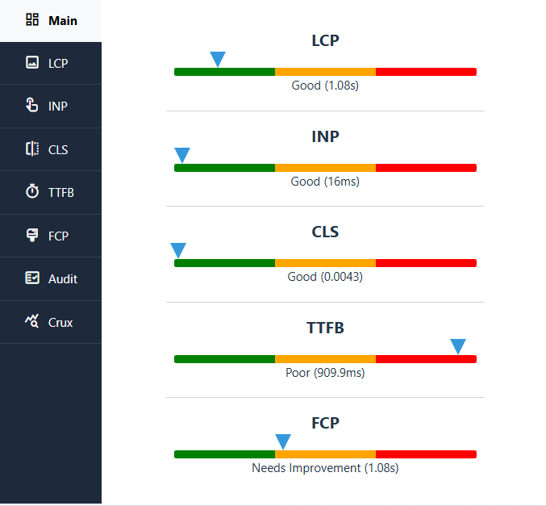
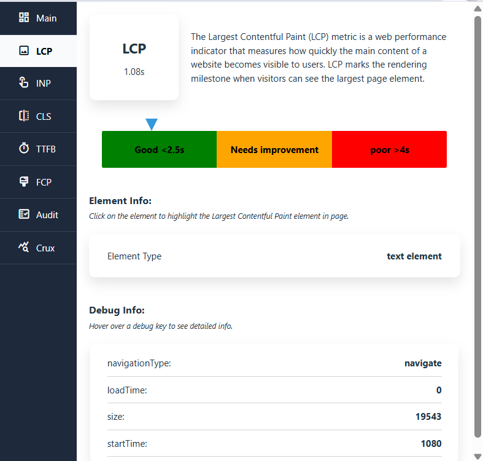
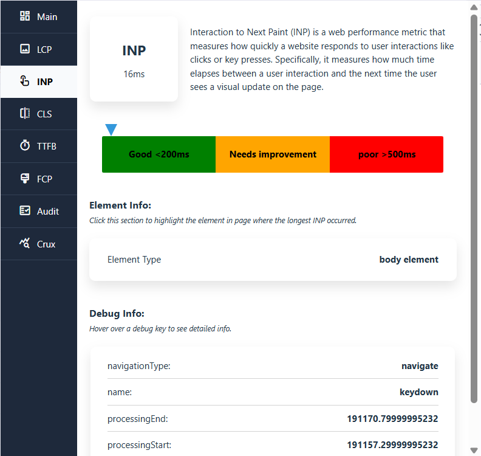
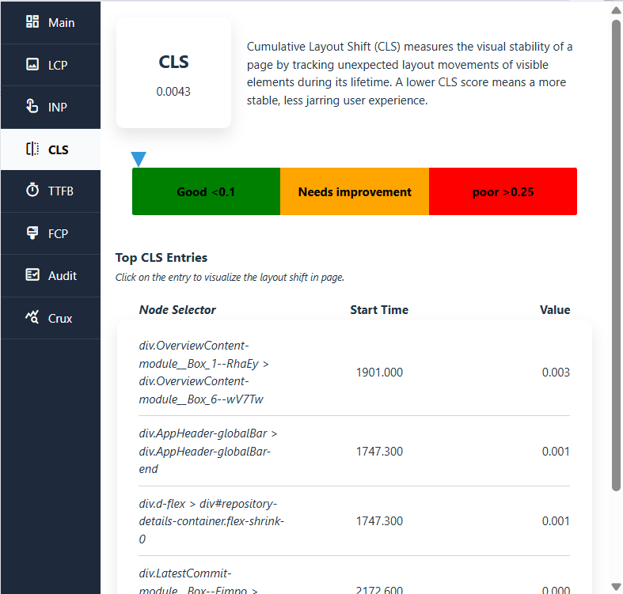
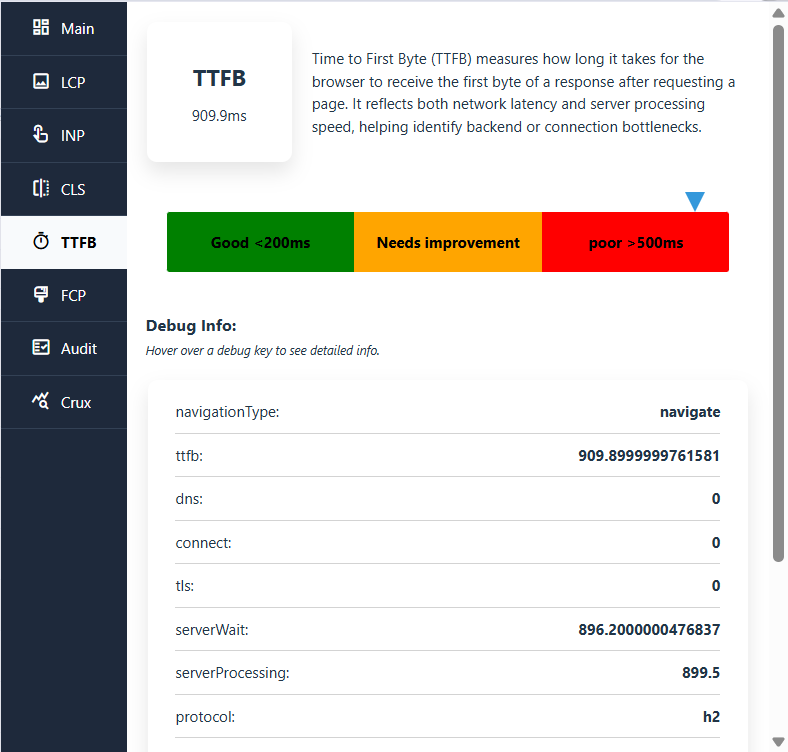
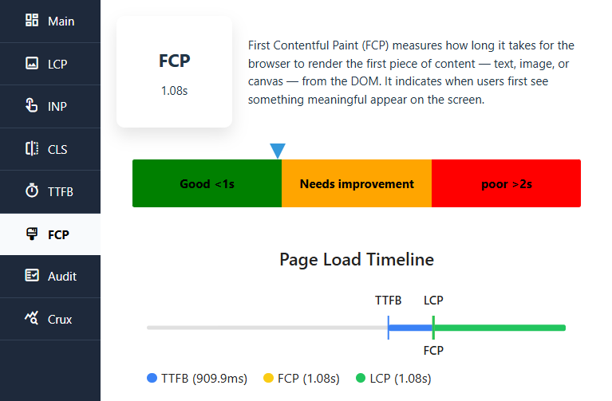
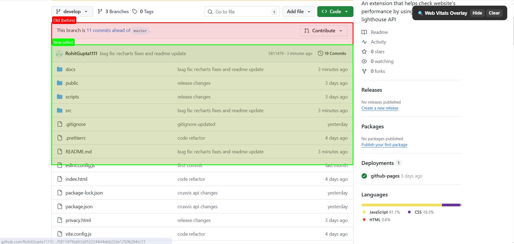
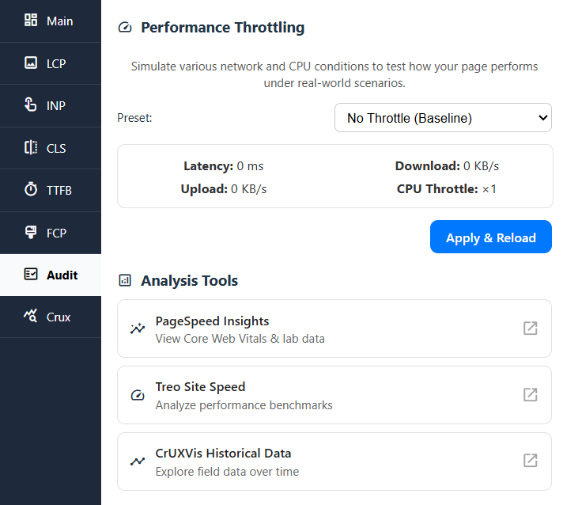
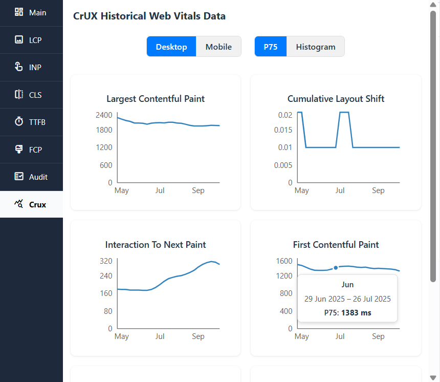
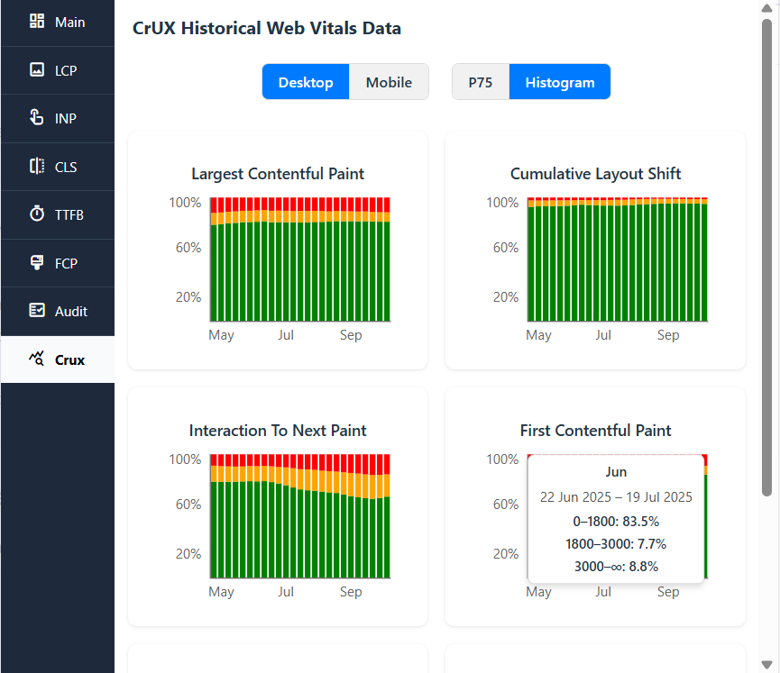

# 🚀 Performance Insight – Chrome Extension

Performance Insight is a **Chrome Developer Tool Extension** built with **React + Vite (Manifest V3)** that helps developers measure, analyze, and debug **Core Web Vitals in real-time**.  
It provides actionable insights for improving web performance along with intelligent suggestions based on Web Vitals data.

---

## 📌 Key Features

### ✅ **Real-Time Core Web Vitals**

Uses **PerformanceObserver API** & **Web Vitals Library** to capture all 5 Core Web Vitals:

- **LCP (Largest Contentful Paint)**
- **INP (Interaction to Next Paint)**
- **CLS (Cumulative Layout Shift)**
- **FCP (First Contentful Paint)**
- **TTFB (Time to First Byte)**

Each metric displays:  
✔ Current value  
✔ Threshold-based status (Good / Needs Improvement / Poor)  
✔ Web Vitals debug information

  

  

---

### 🎯 **Element Highlighting in the Page**

- Highlights DOM elements responsible for poor **LCP, CLS, and INP** scores.
- Injected using **content scripts** without modifying the page source.
- Helps developers visually identify layout shifts, slow paint elements, and input delays.

 

---

### 🛠 **Network & CPU Throttling (Chrome Debugger API)**

- Built-in controls to simulate **Slow 3G / Fast 3G / CPU slowdown**.
- Uses `chrome.debugger` to emulate real-world low-performance scenarios—similar to Chrome DevTools.

---

### 🌐 **External Performance Tools Integration**

Direct access buttons (opens in a new tab) for:

- **Google PageSpeed Insights**
- **Treo Site Performance Overview**
- **CrUX Visualizer (CrUXVis)**



---

### 📊 **6-Month Historical CrUX API Data (Field Data)** — *New*

Performance Insight now supports fetching and visualizing **6 months of historical CrUX field data** using the **Chrome UX Report (CrUX) History API**.

The extension retrieves monthly performance trends for:

- **LCP**
- **INP**
- **CLS**
- **FCP**
- **TTFB**
- **RTT**

**Included features:**

✔ Fetches 6 months of real-world field user performance  
✔ Trend charts built with **Recharts.js**  

 

---

### 💡 **Intelligent Suggestions (Rule-based Engine)**

Based on real-time Web Vitals values, the extension generates practical recommendations.  
Examples:

- “LCP exceeds 4s – optimize hero image or reduce render-blocking CSS.”  
- “CLS > 0.1 – consider reserving space for images/ads to prevent layout shift.”  
- “INP is high – reduce heavy JavaScript on input event listeners.”

---

## 📊 Upcoming (Roadmap)

✔ **In Development**

- Trend chart enhancements & comparative overlays  
- Data export as **JSON / CSV**  
- AI-powered insights using OpenAI API (future upgrade)

---

## 🧩 Tech Stack

| Layer            | Technology                                           |
| ---------------- | ---------------------------------------------------- |
| Framework        | React + Vite (Chrome Extension MV3)                  |
| Performance APIs | Web Vitals, PerformanceObserver, Chrome Debugger API |
| UI & Charts      | React, Tailwind (if added), Recharts (used for CrUX) |
| External APIs    | PageSpeed Insights, Treo, CrUX History (6-month field data) |
| Communication    | chrome.runtime messaging + content scripts           |
| Debugging        | DOM overlays, injected styles, throttling simulation |

---

## 🛠 Installation (Local Development)

```bash
# 1️⃣ Install dependencies
npm install

# 2️⃣ Build extension
npm run build

# 3️⃣ Load in Chrome:
# - Open chrome://extensions/
# - Enable "Developer Mode"
# - Click "Load unpacked" → select /dist folder
